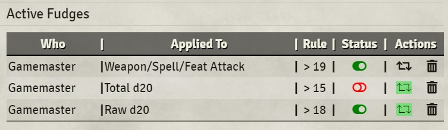

# Die Hard
This Foundry VTT module is intended to provide functionality that modifies/adjusted die rolls in certain systems.

**NOTE:** This module is still VERY alpha and under active development.  I would not recommend using in a real game yet...

# Reporting Issues and Suggestions
Open an issue: https://github.com/UranusBytes/foundry-die-hard/issues

# Development Planning
Currently being (quasi) managed here: https://github.com/users/UranusBytes/projects/1

## Currently Supported Functionality
* DND5e (current)

## Future Supported Functionality
* PF2e

## Currently Supported Functionality
### Fudge

With the module enabled, a poop icon will be displayed above the message tray. 

Clicking on this icon will open a configuration dialog.

Within the dialog, to create a new Fudge do the following:
* Select the radio beside the actor (currently only PCs) this should affect
* Select the type of roll this should affect
* Enter a formula using the format of "OPERATOR VALUE"
  * Available operators are:
    * `<`
    * `<=`
    * `>`
    * `>=`
    * `=`
    * `!=`
  * Examples: `< 5` or `> 15`
* Click on `Create Fudge`

All active fudges are listed at the bottom.
To delete an active fudge

#### Mechanics
The way Fudge works is that the next die roll of that type for that Actor will be evaluated against the formula defined.  If it doesn't meet the formula criteria, then the die is rerolled in the background (max of 150 times), with the final result presented to the PC.  The GM will get a whisper that outlines if the fudge was used (with all failed results), or if it was removed without being used (if first roll met formula criteria).

## Future Planned Functionality
### Karmic dice
All for gradual adjustment/influence of player dice over time...
