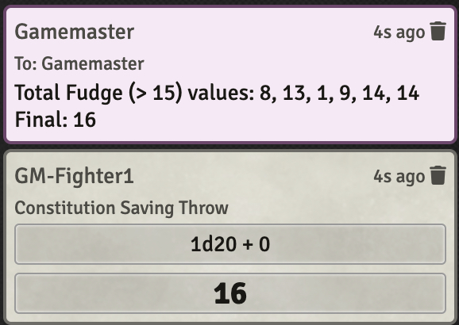
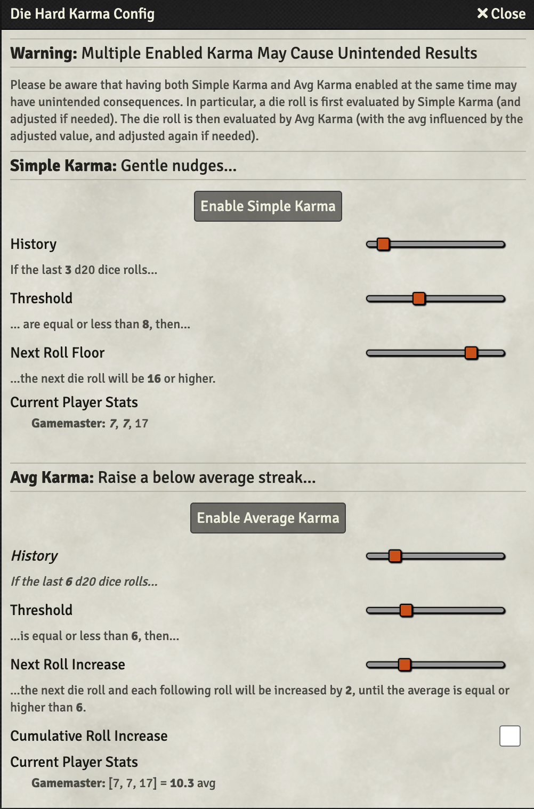

  

  

Die Hard
========
This Foundry VTT module is intended to provide functionality that modifies/adjusted die rolls in certain systems.

**NOTE:** This module is still VERY alpha and under active development.  I would not recommend using in a real game yet...

Development
===========
## Reporting Issues and Suggestions
Open an issue: https://github.com/UranusBytes/foundry-die-hard/issues

## Future Planning
Currently being (quasi) managed here: https://github.com/users/UranusBytes/projects/1

## Currently Supported Systems
* DND5e (current)
* PF2e

## Troubleshoot
Extensive logging is used within the module, with debug logging enabled with the package debugging enabled

## Known Issues
* It's possible to define a fudge that is impossible to achieve (especially when considering modifiers.  Or to define a fudge of "> 20" for a d20).  The failsafe is attempting to fudge 150 times, at which point the closest possible is provided.
* When the fudge config dialog is open, fudge status/list is not updated if any are changed by other GMs and/or PC/Actor rolls
* Completely incompatible with [Better Rolls for 5e](https://github.com/RedReign/FoundryVTT-BetterRolls5e) #6
* If both Fudge and Karma are enabled, a single roll that's being fudged can be influed by karma
* Incompatible with [Monk's Token Bar](https://github.com/ironmonk88/monks-tokenbar) #24

# Current module Functionality
## Fudge
Allow the GM to influence raw die rolls (just the dice) or roll totals (dice + modifiers)
## Karma
Keep a history of die rolls per user, and if they are below a threshold over a defined history, either force the next roll to be above a minimum value (Simple), or increase the roll by a small amount until the average is above the threshold (Average)

# Global Config
The individual functionality can be enabled/disabled within the module settings

# Fudge

With the module enabled, a poop icon will be displayed above the message tray. 

If there are active fudges, the poop icon will pulse orange

Clicking on this icon will open a configuration dialog.

Right clicking on the poop icon will pause all fudges.  Right clicking again will resume all fudges.

Within the dialog, to create a new Fudge do the following:
* Select the GM/Online Player/actor (currently only online player PCs) this should affect
* Select the type of roll this should affect (system specific, roll total, or raw die roll)
* Enter a formula using the format of "OPERATOR VALUE"
  * Available operators are:
    * `<`
    * `<=`
    * `>`
    * `>=`
    * `=`
    * `!=`
  * Examples: `< 5` or `> 15`
* Click on `Create Fudge`

All active fudges are listed at the right.
Status details if a fudge is active or disabled.
A green circular arrow means the fudge will re-enable itself after being used (persistent on)

## Mechanics
The way Fudge works is that the next die roll of that type (either system specific, total result w/ modifiers, or a raw die roll) for that Player or Actor will be evaluated against the formula defined.  If it doesn't meet the formula criteria, then the result is rerolled in the background (max of 150 times), with the final result presented to the PC.  As it is re-rolling, if the attempted re-roll is "closer" to the desired fudge value, it will be kept.  (For circumstances where the fudge can never be achieved, at least get as close as possible)  The GM will get a whisper that outlines if the fudge was used (with all failed results), or if it was removed without being used (if first roll met formula criteria).  When a fudge is used to influence a die (or would have, but original result was sufficient), then the fudge is disabled (unless persistence is enabled). 

# Karma

With the module enabled, a praying hands icon will be displayed above the message tray. 

Clicking on this icon will open a configuration dialog.
The available karma options can be enabled by clicking on the button

Within the dialog, the logic used to influence each Karma module is adjustable.  For Avg Karma, the adjustment can be consistent (+X, +X, +X, etc.) until the threshold is reached, or it can be cumulative (+X, +2X, +3X, etc...) until the threshold is reached.
The current history of player rolls is displayed.

# Mechanics
Karma only works on raw die rolls; it does not influence total rolls directly (only indirectly by influencing the raw rolls).

For Simple Karma, it looks at the previous N rolls, and if all are below the threshold it will ensure that the following roll is over the value of Y.

For Avg Karma, it averages the previous N rolls, and if the average is below the threshold it will adjust (nudge) the result by an increment of Y.  Y can be consistent (+X, +X, +X, etc.) or cumulative (+X, +2X, +3X, etc...).  Each successive roll will be adjusted until the avg threshold is reached.

# Future Planned Functionality
## RNG Alternatives
Alternative RNG 

# Thanks
None of this module would be possible without the inspiration, and continued guidance/support/feedback, from @apoapostolov.  Thank you!